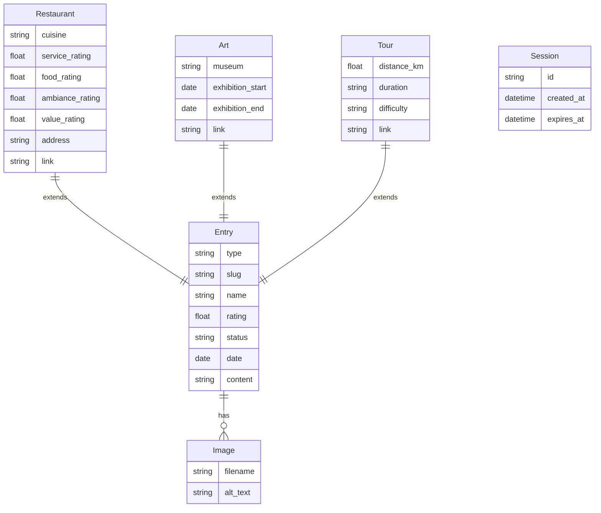

# Domain Model - Eat, Hike & Art

## Overview

The application manages three types of review entries, stored as Markdown files with YAML frontmatter. This document defines the data structures and their relationships.

---

## Entity Diagram



---

## Entry Types

### Base Entry (all types)

All entries share these common fields:

| Field | Type | Required | Description |
|-------|------|----------|-------------|
| `type` | enum | ✅ | `restaurant` \| `art` \| `tour` |
| `name` | string | ✅ | Name of the place/exhibition/tour |
| `rating` | float | ✅ | Overall rating 1-5 (0.5 increments) |
| `status` | enum | ✅ | `draft` \| `active` \| `inactive` |
| `date` | date | ✅ | Review date (YYYY-MM-DD) |
| `images` | string[] | ❌ | List of image filenames |
| `content` | markdown | ✅ | Free-form review text (body) |

### Restaurant

Additional fields for restaurant reviews:

| Field | Type | Required | Description |
|-------|------|----------|-------------|
| `cuisine` | string | ✅ | Type of cuisine (e.g., "italienisch", "deutsch") |
| `ratings.service` | float | ✅ | Service rating 1-5 |
| `ratings.food` | float | ✅ | Food rating 1-5 |
| `ratings.ambiance` | float | ✅ | Ambiance rating 1-5 |
| `ratings.value` | float | ✅ | Value for money rating 1-5 |
| `address` | string | ❌ | Street address |
| `link` | url | ❌ | Website URL |

### Art (Exhibition)

Additional fields for art exhibition reviews:

| Field | Type | Required | Description |
|-------|------|----------|-------------|
| `museum` | string | ✅ | Museum or gallery name |
| `exhibition_start` | date | ❌ | Exhibition start date |
| `exhibition_end` | date | ❌ | Exhibition end date |
| `link` | url | ❌ | Exhibition URL |

### Tour

Additional fields for hiking/city tour reviews:

| Field | Type | Required | Description |
|-------|------|----------|-------------|
| `distance_km` | float | ❌ | Distance in kilometers |
| `duration` | string | ❌ | Estimated duration (e.g., "3 Stunden") |
| `difficulty` | enum | ❌ | `leicht` \| `mittel` \| `schwer` |
| `link` | url | ❌ | External link (e.g., Komoot) |

---

## File Examples

### Restaurant Entry

```markdown
---
type: restaurant
name: "Mälzer Brau- und Tafelhaus"
rating: 4.5
cuisine: "deutsch"
ratings:
  service: 4
  food: 5
  ambiance: 4.5
  value: 4
address: "Heiligengeiststraße 39, 21335 Lüneburg"
link: "https://www.maelzer-lueneburg.de"
status: active
date: 2025-01-04
images:
  - hero.jpg
  - bratwurst.jpg
  - innenraum.jpg
---

Das Mälzer in der Lüneburger Altstadt ist eine Institution. Die hausgebrauten
Biere sind hervorragend, besonders das dunkle Mälzer-Bräu.

## Essen

Die Küche bietet deftige norddeutsche Hausmannskost. Die Bratwurst mit
Sauerkraut war perfekt, knusprig gegrillt und würzig.

## Ambiente

Rustikale Einrichtung mit viel Holz und Kupfer. Im Sommer ist der Biergarten
ein Highlight.
```

### Art Entry

```markdown
---
type: art
name: "Caspar David Friedrich - Wanderer"
rating: 5
museum: "Hamburger Kunsthalle"
exhibition_start: 2024-12-15
exhibition_end: 2025-04-13
link: "https://www.hamburger-kunsthalle.de/ausstellungen/caspar-david-friedrich"
status: active
date: 2025-01-02
images:
  - kunsthalle-eingang.jpg
  - wanderer-ueber-nebelmeer.jpg
---

Eine beeindruckende Retrospektive zum 250. Geburtstag des Romantikers.

## Highlights

Der "Wanderer über dem Nebelmeer" im Original zu sehen ist ein Erlebnis.
Die Ausstellung zeigt auch weniger bekannte Werke und Skizzen.

## Tipp

Früh kommen oder Online-Tickets buchen – die Ausstellung ist sehr beliebt.
```

### Tour Entry

```markdown
---
type: tour
name: "Elbe-Radweg: Hamburg nach Lauenburg"
rating: 4
distance_km: 55
duration: "4-5 Stunden"
difficulty: "leicht"
link: "https://www.komoot.de/tour/123456789"
status: active
date: 2024-12-28
images:
  - elbe-panorama.jpg
  - lauenburg-altstadt.jpg
---

Eine wunderschöne Tagestour entlang der Elbe, größtenteils auf dem Deich.

## Strecke

Start am Hamburger Hafen, über Bergedorf, Geesthacht bis Lauenburg.
Der Weg ist flach und gut ausgeschildert.

## Einkehr

In Lauenburg gibt es mehrere nette Cafés in der Altstadt. Zurück geht es
bequem mit der Regionalbahn.
```

---

## Status Flow


| Status | Visibility | Description |
|--------|------------|-------------|
| `draft` | Admin only | New entry, awaiting review |
| `active` | Public | Published and visible |
| `inactive` | Admin only | Soft-deleted, hidden from public |

---

## File Naming Convention

```
{date}-{slug}.md
```

| Part | Format | Example |
|------|--------|---------|
| date | YYYY-MM-DD | 2025-01-04 |
| slug | kebab-case | maelzer-brauhaus |

**Examples:**
- `2025-01-04-maelzer-brauhaus.md`
- `2025-01-02-caspar-david-friedrich-wanderer.md`
- `2024-12-28-elbe-radweg-hamburg-lauenburg.md`

---

## Image Organization

```
/var/www/data/images/
├── restaurants/
│   └── maelzer-brauhaus/          # matches slug
│       ├── hero.jpg
│       ├── bratwurst.jpg
│       └── innenraum.jpg
├── art/
│   └── caspar-david-friedrich-wanderer/
│       ├── kunsthalle-eingang.jpg
│       └── wanderer-ueber-nebelmeer.jpg
└── tours/
    └── elbe-radweg-hamburg-lauenburg/
        ├── elbe-panorama.jpg
        └── lauenburg-altstadt.jpg
```

**Image References in Frontmatter:**
- Only filename, not full path
- Path constructed from `type` + `slug` + `filename`

```typescript
function getImageUrl(entry: Entry, filename: string): string {
  return `/images/${entry.type}s/${entry.slug}/${filename}`;
}
// → /images/restaurants/maelzer-brauhaus/hero.jpg
```

---

## TypeScript Interfaces

```typescript
// Base entry type
interface BaseEntry {
  type: 'restaurant' | 'art' | 'tour';
  slug: string;           // derived from filename
  name: string;
  rating: number;         // 1-5, 0.5 increments
  status: 'draft' | 'active' | 'inactive';
  date: string;           // YYYY-MM-DD
  images: string[];
  content: string;        // Markdown body
}

// Restaurant-specific
interface RestaurantEntry extends BaseEntry {
  type: 'restaurant';
  cuisine: string;
  ratings: {
    service: number;
    food: number;
    ambiance: number;
    value: number;
  };
  address?: string;
  link?: string;
}

// Art-specific
interface ArtEntry extends BaseEntry {
  type: 'art';
  museum: string;
  exhibition_start?: string;
  exhibition_end?: string;
  link?: string;
}

// Tour-specific
interface TourEntry extends BaseEntry {
  type: 'tour';
  distance_km?: number;
  duration?: string;
  difficulty?: 'leicht' | 'mittel' | 'schwer';
  link?: string;
}

// Union type
type Entry = RestaurantEntry | ArtEntry | TourEntry;

// Session (for authentication)
interface Session {
  id: string;
  createdAt: string;
  expiresAt: string;
}
```

---

## Validation Rules

### Rating Values

| Field | Min | Max | Step |
|-------|-----|-----|------|
| `rating` | 1 | 5 | 0.5 |
| `ratings.service` | 1 | 5 | 0.5 |
| `ratings.food` | 1 | 5 | 0.5 |
| `ratings.ambiance` | 1 | 5 | 0.5 |
| `ratings.value` | 1 | 5 | 0.5 |

### Required Fields by Type

| Field | Restaurant | Art | Tour |
|-------|------------|-----|------|
| `name` | ✅ | ✅ | ✅ |
| `rating` | ✅ | ✅ | ✅ |
| `status` | ✅ | ✅ | ✅ |
| `date` | ✅ | ✅ | ✅ |
| `cuisine` | ✅ | - | - |
| `ratings.*` | ✅ | - | - |
| `museum` | - | ✅ | - |

---

## Queries (implemented in code)

### Get Active Entries by Type

```typescript
async function getActiveEntries(type: string): Promise<Entry[]> {
  const entries = await getAllEntries(type);
  return entries
    .filter(e => e.status === 'active')
    .sort((a, b) => new Date(b.date).getTime() - new Date(a.date).getTime());
}
```

### Get Latest Entries (Homepage)

```typescript
async function getLatestEntries(limit: number = 3): Promise<Entry[]> {
  const allTypes = ['restaurants', 'art', 'tours'];
  const allEntries = await Promise.all(allTypes.map(getActiveEntries));

  return allEntries
    .flat()
    .sort((a, b) => new Date(b.date).getTime() - new Date(a.date).getTime())
    .slice(0, limit);
}
```

### Get Leaderboard

```typescript
async function getLeaderboard(
  type: string,
  cuisine?: string
): Promise<Entry[]> {
  let entries = await getActiveEntries(type);

  if (type === 'restaurants' && cuisine) {
    entries = entries.filter(e => e.cuisine === cuisine);
  }

  return entries.sort((a, b) => b.rating - a.rating);
}
```

### Get All Cuisines (for filter)

```typescript
async function getCuisines(): Promise<string[]> {
  const entries = await getActiveEntries('restaurants');
  const cuisines = [...new Set(entries.map(e => e.cuisine))];
  return cuisines.sort();
}
```
